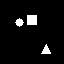
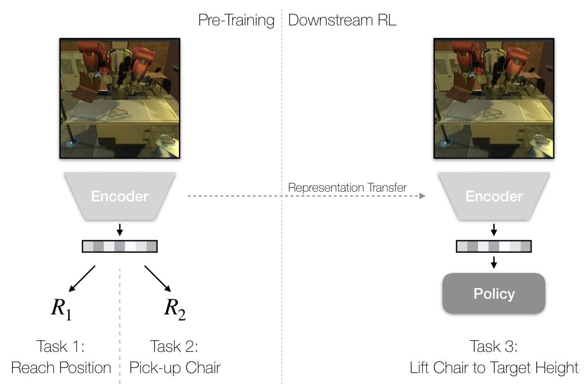
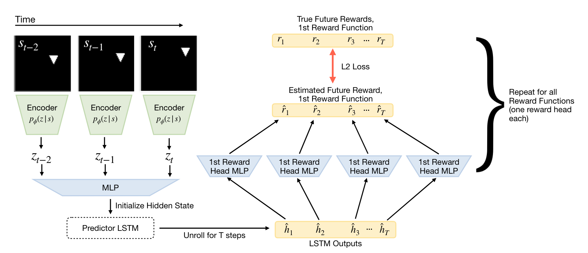
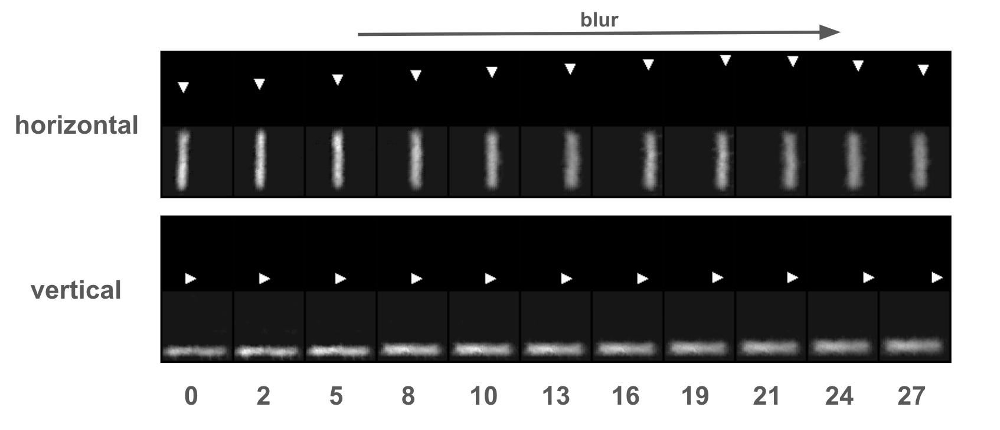
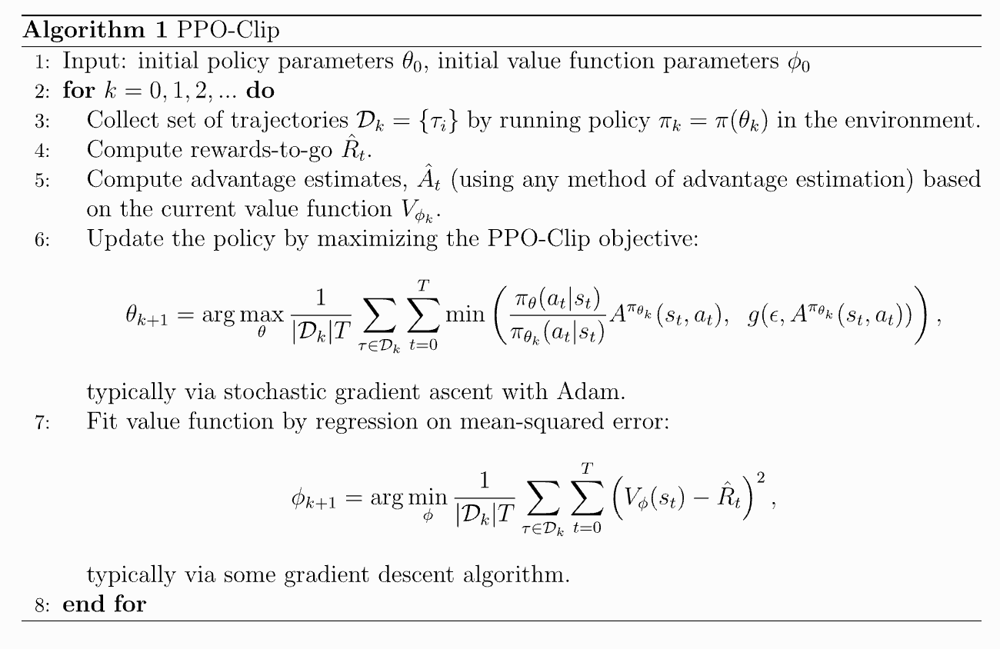
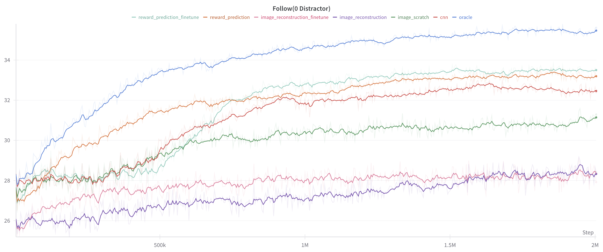
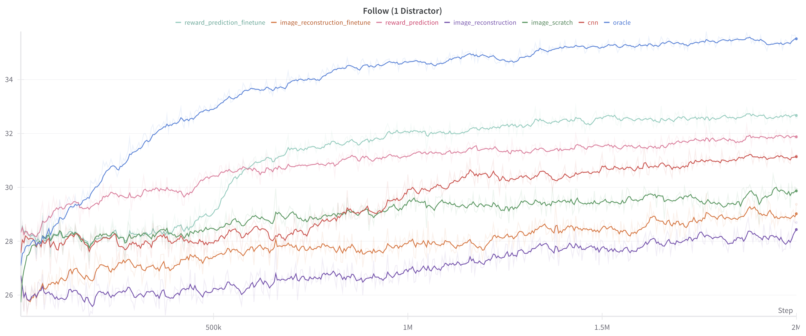
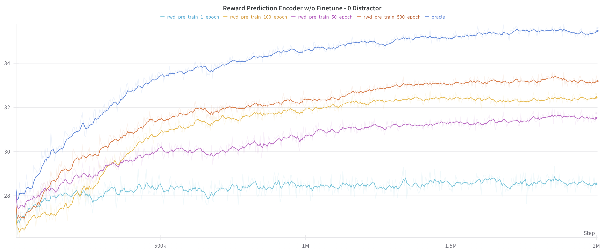

## REWARD-INDUCED REPRESENTATION LEARNING

 The implementation code of [paper](https://arxiv.org/abs/2204.11827), based on the starter [repo](https://github.com/kpertsch/clvr_impl_starter) provided by [CLVR](https://www.clvrai.com/).


### 1.OVERVIEW

* Agent(●) Following Target(■) RL task

    * 0 distractor(▲)
    

    * 1 distractor(▲)
    

* introduction


* reward-induced representation model


### 2.Get Start

* initialize a virtual environment
```
conda create --name myenv python=3.8
conda activate myenv
```
* configure environment dependencies
```
pip install -r requirements.txt
```


### 3.Implementation Tasks

1. re-implement the reward-induced representation learning model

`MODEL` = `Encoder` + `MLPs` + `LSTM` + `rewards_heads(MLPs)`

2. re-plicate the experiment to show the representation ability of model

`EXP` = `Encoder(reward-induced)` + `Detached Decoder`



3. implement [PPO](https://spinningup.openai.com/en/latest/algorithms/ppo.html) to finished the downstream task (agent following target) with reward-induced representation


4. build several representation models as baselines to train downstream task with PPO 

(`cnn`|`image-scratch`|`image-reconstruction`|`image-reconstruction-finetune`|`reward-prediction`|`reward-prediction-fintune`|`oracle`)

5. train all of the above representation models and verify the better performance of reward-induced model





### 4. Files Summary

* `/presentation` : the presentation slides of the implementation task
* `/re_implement_paper` : the notes about the paper 


* `/scripts` : the shell files to run the tasks
* `/sprites_datagen` : the dataset
* `/sprites_env` : the data environment
* `/src` : the src for README
* `/tmp` : the visualization results during training process
* `/weights` : the weights of models


* `baseline.py` : the baseline models for final training
* `general_utils.py` : general tool function
* `model.py` : the pre-trained representation learning models
* `ppo_train.py` : train the whole task with PPO
* `ppo.py` : PPO implementation
* `pre_train.py` : pre-train the representation learning models


* `README.md` : the project info
* `requirement.txt` : environmental dependencies

### 5. Run

1. provide a shell file to each task in `/scripts`
* pre-train representation models  
    * `pretrain_image_recon_decoder.sh`
    * `pretrain_image_recon_model.sh`
    * `pretrain_reward_pred_model.sh`
* train the downsteam task with ppo
    * `ppotrain_cnn.sh`
    * `ppotrain_image_rec_finetune.sh`
    * `ppotrain_image_rec.sh`
    * `ppotrain_image_scratch.sh`
    * `ppotrain_oracle.sh`
    * `ppotrain_reward_pred_finetune.sh`
    * `ppotrain_reward_pred.sh`

2. change the parameters in each shell file like whether using gpus(`gpus_num`) or whether using wandb to record(`is_use_wandb`) 
