### Implementation Task - Reward-Induced

##### 0.TASKs

* [x] Implement the reward-induced representation learning model (see detailed architecture Figure 5). Train the model using the provided dataset. 

* [x] Visualize your training results (learning curves etc) and verify that the model predicts correctly by replicating the results in Figure 2. Note, that you need to add **a detached decoder network** and **train the model on a single reward** only to reproduce the experiment. 

* [x] Implement an RL algorithm of your choice to train **an agent** that can **follow a target shape** (while ignoring distractor shapes) in the provided environment. Before continuing to the next step, verify your implementation by **training a policy** that has access to **the true state of the environment** (i.e. does not need to encode images). This corresponds to **the oracle baseline** in Figure 3. 

* [x] Train **an image-based agent** that **encodes image observations** using **the pre-trained encoder**. Compare **its learning curve** to that of an agent with the same architecture, but trained from scratch (image-scratch baseline in Figure 3). 

* [x] If your implementation is working, (1) **the image-based agent** with pre-training should be able to follow the target shape with **up to one distractor**, and (2) it should learn faster than the **image-based agent** trained from scratch (but likely slower than the oracle).

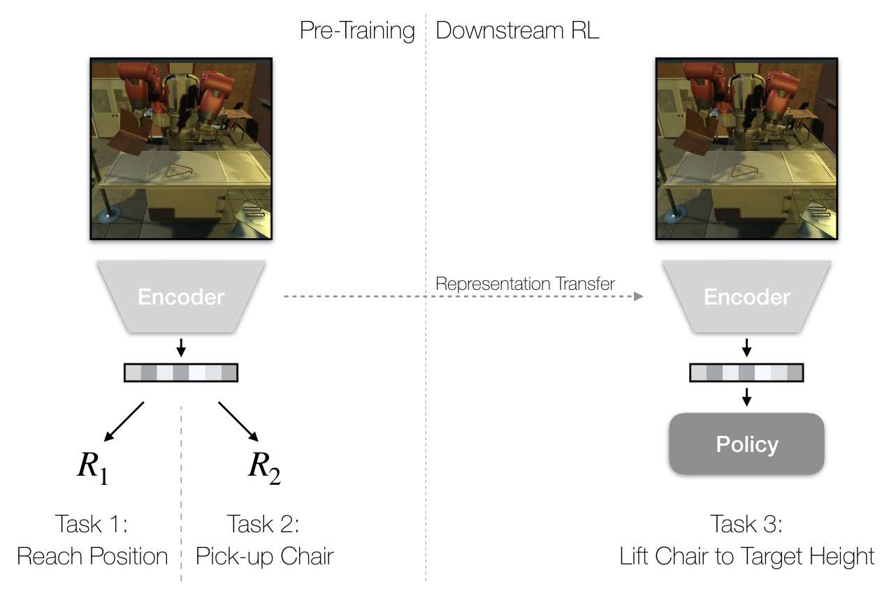
In complex environments we need to learn **representations** that focus on modeling **the important aspects of the environment**
We propose to use **task information** to guide representations as to which parts of the environment are important to model. 

* Left: 
	* We pre-train **a representation** by **inferring reward values for multiple tasks from a shared representation of the high-dimensional input**, 
	* encouraging it to focus on parts of the environment **that are important for solving the training tasks**,
	* e.g. it will focus on the **arm** and the **furniture** pieces instead of **the background texture**. 
* Right: 
	* We can **transfer** this representation into a policy for more efficient learning of downstream tasks 
	* from **the same task distribution** that the representation training tasks were drawn from,
	* e.g. tasks focused on robot and furniture pieces like lifting the chair to a certain height.

##### 1.Introduction
🌅
* People have **the remarkable ability** to **condense** this raw input data stream **into a much compressed representation** on which **the decision making system operates**.
* We need learn to extract useful information from the input using a typically sparse reward signal.
* $\Rightarrow$ To improve **training efficiency** it has become common practice to **pre-train feature extractors** that **reduce the input dimensionality** while trying to retain as much information as possible
🌅
* There are two dominant paradigms for the unsupervised pre-training of such feature extractors: 
	* **Generative**
		The generative approach directly trains a model of the high-dimensional input data via **reconstruction** or **prediction** objectives, constraining an intermediate representation within the model to be low-dimensional, e.g. in VAEs or predictive models.
	* **Discriminative Modeling**
		The discriminative approach instead optimizes a lower-bound on **mutual information** between the high-dimensional input and the representation using noise-contrastive estimation.
* Such approaches are forced to 
	* model all information in the input data
	* cannot **discriminate** between what is useful to model and which **input information** can be ignored
* Highly expressive models are required for modeling all facets of the environment and as a result the efficiency gains for downstream learning reported in prior work only considered relatively clean environments of low detail and complexity
* 🎉In order to scale RL from high-dimensional observations to more complex environments we need representation learning methods that can focus on the important information in the input data
🌅
* **Propose** to use task information for guiding representation learning approaches as to which part of the input information is important to model and which parts can be ignored
* Propose to use **a large dataset of trajectories annotated with rewards** from a multitude of tasks **drawn from the task distribution of interest**
* We train **predictive models** over these **reward labels** for learning **a reward-induced representation** that captures only information that 
	* **useful for predicting rewards**
	* **useful for solving tasks from this task distribution**

##### 2.Related Work
* There has been a wide range of works that apply different forms of unsupervised representation learning to improve the sample efficiency of reinforcement learning, both generative/predictive models as well as discriminative models
* 🎉**None** of these methods can **discriminate** **between useful and distracting information** in the input and therefore have only been shown to **work on environments** that **do not match** the complexity of **the real world**
* Our work specifically focuses on **learning a representation** that can be used for **solving arbitrary downstream tasks** drawn from **the same task distribution that was used for training the representation**

##### 3.Approach

🌞Preliminaries
* Assume access to a pre-training dataset D of reward-annotated trajectories $τ = \{s^t, a^t, r^t_{1:K} , s^{t+1}, a^{t+1}, r^{t+1}_{1:K} , . . . \}$, with states $s_t$, actions $a_t$ and rewards $r^t_{1:K}$ for $K$ tasks drawn from the task distribution $T$ .
* Note that we do not need to assume complete reward annotations from all $K$ tasks on all $|D|$ trajectories. Instead, a particular trajectory $τ_i$ can have reward annotations from only a subset $T′ ⊆ T$ .
* For simplicity, we will **assume** **complete** reward annotation in the following, but the proposed model can be trivially extended to the **incomplete** case.
* Finally, we **do not make assumptions** on the exploration policy $π_e$ that was used to collect the pre-training dataset 
	**other than** that the resulting trajectories need to provide meaningful interactions with the environment.

🌞Reward-Induced Representations
* A reward prediction model $p_θ(r_{1:K} | x)$ with parameters $θ$ to infer the rewards from $K$ different tasks given the input $x$.
	Factorize the prediction into 
	* An encoder $p_{\phi}(z|x)$
	* K reward-heads $p_{\eta_k}(r_k|z)$
	$$
	p(r_{1:K}|x) = \prod^K_{k=1}∫ p_{\eta_k} (r_k|z) · p_{\phi}(z|x) dz
	$$
	Optimize the parameters $\theta = \{\phi, \eta_1 : K\}$ using a maximum-likelihood objective on the predicted rewards
	
	we can optimize the $MSE$ loss on the predicted rewards $\hat{r}_k$ to learn the representation. For a single training trajectory from the pre-training dataset this takes the form : 
	$$
	L= \sum^T_{t=1}\sum^{K}_{k=1}||r^t_k−\hat{r}^t_k||^2
	$$
* The single-step inference case $p(r{1:K}|x)$. It is however easily extendible to the sequence prediction case, where we predict $T$ future rewards given $N$ conditioning frames
	$$
	p(r^{1:T}_{1:K}|x^{−N+1:0}) = \prod^T_{t=1}\prod^K_{k=1}∫p_{\eta_k}(r^t_k|z^t)·p_{\phi}(z^t|x_{−N+1:t−1})dz
	$$
	In practice we implement this recursive prediction with **an RNN-based** model and optimize with the same objective

🌞Reinforcement Learning with Pre-Trained Representation
* Train policies to optimize the cumulative expected return on downstream tasks: $arg max_π E_π [ ∑^T_{t=1} R_t ]$. 
* To use the pre-trained representation we factorize the policy distribution, using the pre-trained encoder to translate inputs into the representation $z$ : 
	$$
	π(a|x) = π′(a|z) · p_{\phi}(z|x)
	$$
* The optimization of this objective can be performed with any standard RL algorithm, for example value-based approaches or policy gradient methods.

##### 4.Experimental Evaluation

🌕We aim to answer the following questions : 
1. Are **reward-induced representations** 
	**helpful for improving the sample efficiency** of downstream tasks?
2. Are **reward-induced representations** 
	more **robust to visual distractors** in the scene?

🌕Instantiate 
* the **encoder** and **decoder** with simple CNNs
* **the predictive model** with a single-layer LSTM and all reward-heads with 3-layer MLPs. 
* **the Rectified Adam optimizer** with $β_1 = 0.9$ and $β_2 = 0.999$ for pre-training the representation. 
* For RL training, we use $PPO$ with slight modifications to the default hyper-parameters provided in the PyTorch implementation

🌕Environment
The environment features 
* an agent (circle shape)
* a target (square)
* a variable number of distractor objects (triangles)

**For pre-training** : 
	we collect random rollouts annotated with rewards proportional to the x/y position of both agent and target.
**During RL training** : 
	✨During RL training we evaluate on a downstream task in which the agent should **follow** the target.
	✨Eg : 
		Minimize its L2 distance to the target. 
		We use the following reward (where $p_{target}$ and $p_{agent}$ denote target’s and agent’s position)
		$$
		R=1− \frac{1}{\sqrt{2}} · ‖p_{target} − p_{agent}‖^2
		$$
🌕Baselines
For **downstream RL experiments** we compare to the following baselines : 
* ✨cnn
	* Baseline uses a 3-layer CNN with 16 kernels of kernel size 3 and stride 2 to encode an image. 
	* ReLU is used as an non-linear activation. 
	* The output activation is flattened and passed to two fully connected layers of 64 hidden states 
		* to compute 
			* an action 
			* a critic
* ✨image-scratch
	* Baseline adopts the encoder architecture used in representation learning but we **initialize the parameters randomly**. 
	* The output embedding of size 64 is fed into **two 2-layer MLPs** of **32 hidden states**, **one for action** and **one for critic**
* ✨image-reconstruction and image-reconstruction finetune
	 * Baselines use the learned representation on the **image reconstruction** task. 
	 * Given the embedding the action distribution and critic are computed using 2-layer MLPs of 32 hidden states. 
	 * We 
		 * **freeze** the encoder for the baseline (image-reconstruction) 
		 * **finetune** the encoder for the baseline (image-reconstruction finetune).
* ✨reward-prediction and reward-prediction finetune
	* Baselines use the learned representation on **the reward prediction** task.
	* Given the embedding the action distribution and critic are computed using 2-layer MLPs of 32 hidden states. 
		* We 
			* freeze the encoder for the baseline (reward-prediction) 
			* finetune the encoder for the baseline (reward-prediction finetune).
* ✨oracle
	* Take **a state representation** as input. 
	* The state representation consists of $(x,y)$ coordinates of the agent, target, and distractors. 
	* The 2-layer MLPs of 32 hidden states are used to predict both action and critic. 
	* This method shows **the upper bound** of our method.

🌕Analysis of Learned Representation

✨
* First
	Analyze the properties of reward-induced representations.
	We try to elicit 
	* What information is captured in the representation by training an image decoder to **reconstruct** the original image from the representation.
	* The gradients from the image decoder are stopped before the representation, leaving the ladder unchanged by the probing network’s training.

✨
* For two simple rewards indicate that the reward-induced representation indeed **only captures information** about the input that **are useful for inferring reward**
	* As the decoder is not able to infer the position of the object along the axis that has no influence on the reward used for training the representation.	
	  📊
	
	  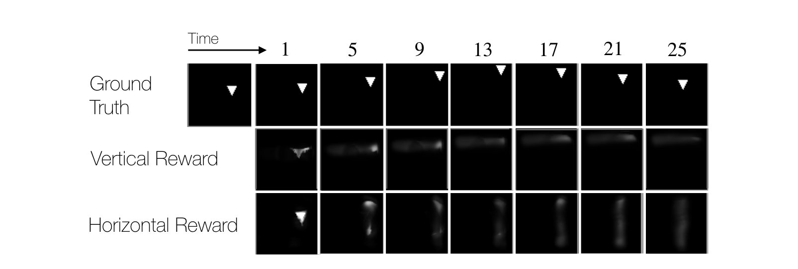Detached decodings of reward-induced representations. 
	
	* Top: Ground truth sequence. 
	
	* Middle: Decoding of representation learned with reward proportional to the vertical coordinate. 
	
	* Bottom: Same, but with reward proportional to horizontal coordinate. 
	Representations retain **information about the position that influences the reward**, but **no information about the other coordinate**, which **leads to blurry predictions on the latter axis**.

✨
* To also quantify how **much** of **the important information** is captured **in reward-induced representations** compared to **conventional**, **image-based representations**. 
	* We compare **values for different numbers of visual distractors** in the scene and find that **reward-induced representations** are **better able to capture the important information** in the scene across all scenarios.
	
	* Further, they prove **fairly robust to increased noise**
	
	* Representation learned via image prediction objectives on the other hand 
		are **not able to capture all important information**, leading to **worse regression accuracy**, 
		because **during training** they **receive no guidance** on what is important to model and what can be ignored.
		📊
	
		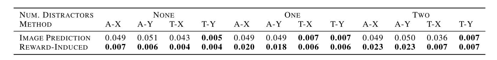
		Reward regression MSE values for different representations with no, one and two distractors.
		
	* A-X denotes reward proportional to the **agent’s horizontal position**
	
	* T-Y indicates reward proportional to the **target’s vertical position**
	  The reward-induced representation 
	
	* enables more accurate reward regression 
	
	* is also fairly robust to increasing amounts of noise 
	
	* while the image prediction based representation fails to capture information necessary to regress all rewards accurately.

🌕Reward-Induced Representations for Reinforcement Learning

✨

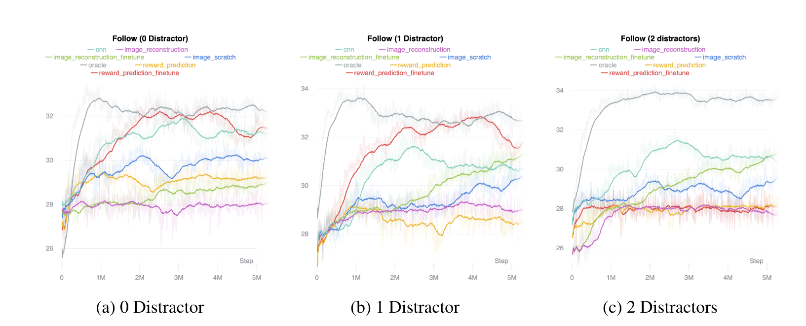
We compare the speed of training and convergence across all the baselines discussed above. 

* Oracle baseline acts over the most compact state representation containing shape positions and consequently performs the best. 
* reward-prediction finetune comes second both in speed and final convergence for environments with zero and one distractor. 
* cnn learns slower than our method, but converges to similar values in the end. 
* Other methods struggle to attain similar performance. 
This shows that **reward prediction** leads to **a good encoder initialization for downstream tasks**, and this **is faster than a randomly initialized CNN encoder**. 
It is **much better than image_scratch** which uses a similarly sized encoder as our method. 
Note that cnn performs better than image_scratch because of **its small sized CNN network** suitable for RL.

✨

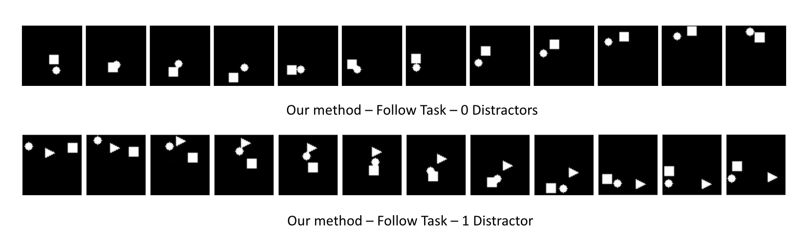

* It shows qualitative rollouts of reward-prediction fine-tune upon convergence on the follow task with **0** and **1** distractor.
* The agent (circle) successfully follows the target (square) even in the presence of distractors (triangles).

Similar performance cannot be attained with 2 distractors.
* This can be attributed to the reward prediction possibly overfitting during training. Therefore, the oracle method can be seen to perform very well, followed by the standard cnn policy.
* Interestingly, image_reconstruction finetune also performs well on this task since it is able to maintain information about the agent, target and distractors, which can be extracted by the RL policy.
* However, this is still slower in comparison to the small CNN network based policy.

While we can show that our method is more robust than baselines in the case of a single distractor, we hope to further improve our method on multiple distractors with better training schemes.

##### 5.Discussion
* Reward-induced representations are able to improve the learning efficiency of downstream reinforcement learning applications more efficiently than conventional, image-predictionbased representations.
* we showed that reward-guidance improves the robustness to visual distractors in the scene, an important step towards the applicability of representation learning methods to the real world.

##### 6.Architecture - the reward prediction model
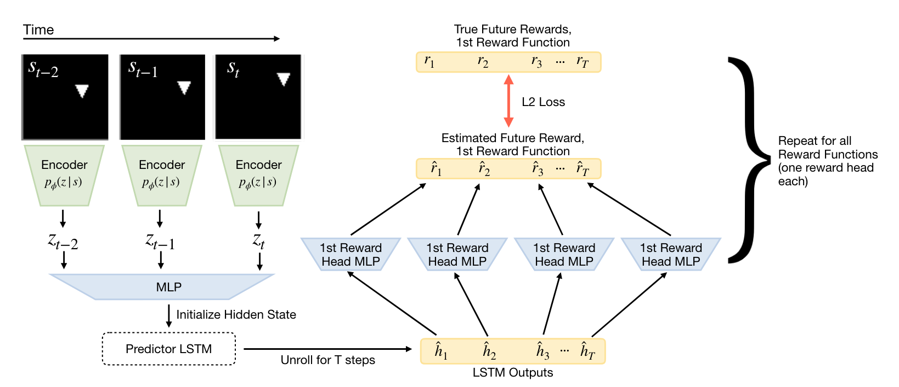

* All MLPs have **3 layers with 32 hidden units**. 
* The image encoder uses **strided convolutions** to reduce the image resolution by a factor of 2 in every layer, until the spatial resolution is 1x1 (i.e. the number of layers is determined by the input resolution). 
* The number of channels gets doubled in every layer starting with 4 channels in the first layer. 
* The final 1x1 feature vector gets mapped to **a 64-dimensional observation space** using a linear layer. 
* The **encoder** (**green**) is transferred to the RL policy, where it is used to encode the image inputs.
* LSTM
	* 🌞	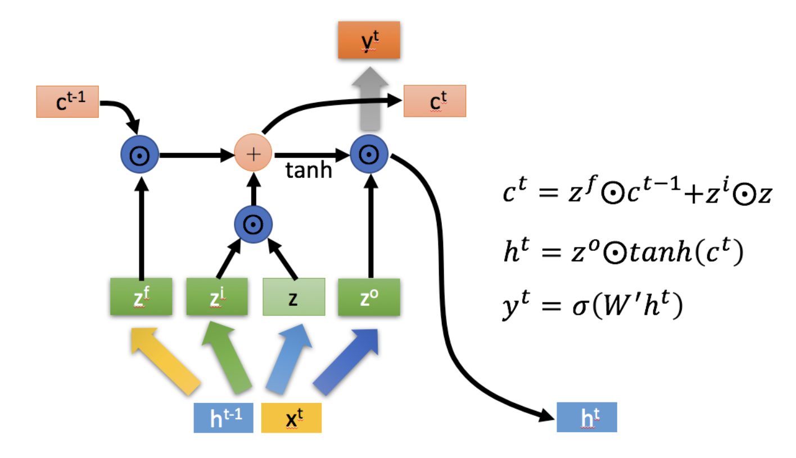
	* 🌞		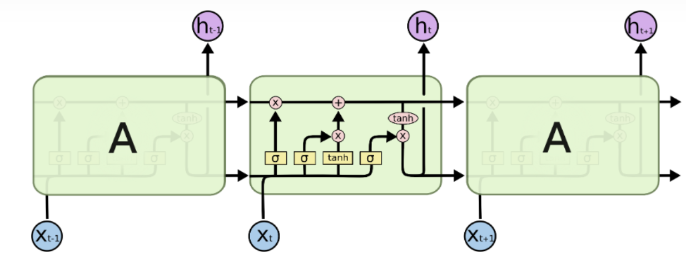

##### 7.Actor-Critic
1. DQN - CRITIC(like)
	* TD error(Temporal Difference error)
		* $TDerror=r+\gamma V(s')-V(s)$
			* The definition of TD error is based on state transitions in a Markov Decision Process (MDP). Given a state $s$, when an agent takes an action $a$ and observes the next state $s′$ along with an immediate reward $r$, the TD error can be expressed as the above equation.
		* $TD error = r+\gamma max_{a'}Q(s',a')-Q(s,a)$
			* The TD error in DQN
	* The **Critic**'s task is to make the TD-error as small as possible. Then TD-error updates the Actor.
		* In order to avoid the positive number trap, we want the Actor's update weight to be positive or negative. Therefore, we subtract their mean $V$ from the $Q$ value. have, $Q(s,a)-V(s)$
		* In order to avoid the need to estimate $V$ and $Q$ values, we hope to unify $Q$ and $V$, Due to $Q(s,a) = \gamma * V(s') + r - V(s)$, so we get TD-error： $TD-error = \gamma * V(s') + r - V(s)$
		* TD-error is the weight value in the weighted update when the Actor updates the strategy.
		* Now the critic no longer needs to estimate $Q$, but estimates $V$. According to what we have learned from the Markov chain, we know that TD-error is the loss required by the Critic network. In other words, the Critic function needs to minimize TD-error.

2. Policy Gradient - ACTOR(like)
	* The **reward** function is defined as : 
		$J(\theta)=\sum_{s\in S} d^{\pi}(s)V^{\pi}(s)=\sum_{s\in S}d^{\pi}(s)\sum_{a\in A}\pi_{\theta}(a|s)Q^{\pi}(s,a)$
		* where $d^{\pi}(s)$ is the stationary distribution of Markov chain for $\pi_{\theta}$ (on-policy state distribution under $\pi$).
	* REINFORCE(Monte-Carlo)
		* **REINFORCE** (**Monte-Carlo** policy gradient) relies on an estimated return by Monte-Carlo methods using episode samples to update the policy parameter $\theta$. REINFORCE works because the expectation of the sample gradient is equal to the actual gradient :
			* $\nabla_{\theta}J(\theta) = E_{\pi}[Q^{\pi}(s,a)\nabla_{\theta}ln\pi_{\theta}(a|s)] = E_{\pi}[G_t\nabla_{\theta}ln\pi_{\theta}(A_t|S_t)]$

3. **Actor-Critic**
	* Two main components in policy gradient are **the policy model** and **the value function**. It makes a lot of sense to learn the value function in addition to the policy, since knowing the value function can assist the policy update, such as by reducing gradient variance in vanilla policy gradients, and that is exactly what the **Actor-Critic** method does.
	* Actor-critic methods consist of two models, which may optionally share parameters:
		* Critic updates the value function parameters w and depending on the algorithm it could be **action-value** $Q_w(a|s)$ or **state-value** $V_w(s)$
		* Actor updates the policy parameters $\theta$ for $\pi_{\theta}(a|s)$, in the direction suggested by the critic.
	* A simple action-value actor-critic algorithm - **QAC** - from [Lil'Log](https://lilianweng.github.io/posts/2018-04-08-policy-gradient/)	
		1. Initialize $s,\theta,w$ at random; sample $a$ ~ $\pi_{\theta}(a|s)$
		2. For $t$ = $1...T$ : 
			1. Sample reward $r_t$ ~ $R(s,a)$ and next state $s'$ ~ $P(s'|s,a)$
			2. Then sample the next action $a'$~$\pi_{\theta}(a'|s')$
			3. Update the policy parameters: $\theta \Leftarrow \theta+ \alpha_{\theta}Q_{w}(s,a)\nabla_{\theta}ln\pi_{\theta}(a|s)$
			4. Compute the correction (TD error) for action-value at time t:
				$\delta_t=r_t + \gamma Q_w(s',a')-Q_w(s,a)$
				and use it to update the parameters of action-value function : 
				$w\leftarrow w+\alpha_w \delta_t\nabla_wQ_w(s,a)$
			5. Update $a\leftarrow a'$ and $s\leftarrow s'$
		* Two learning rates, $\alpha_{\theta}$ and$\alpha_w$, are predefined for policy and value function parameter updates respectively.
		* QAC		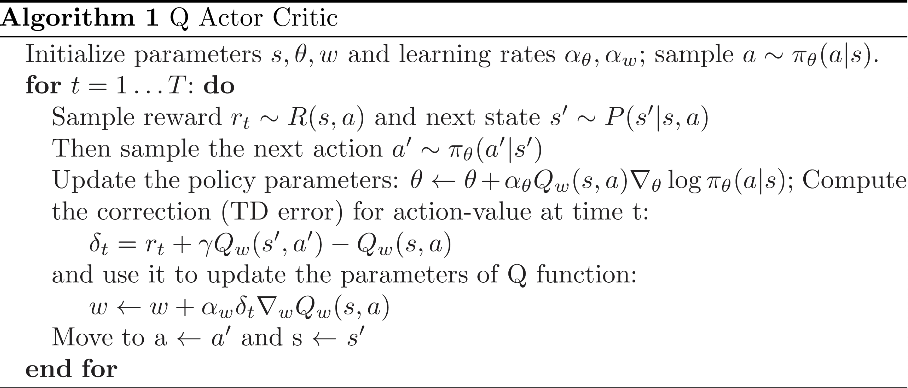
		
	* Advantage Actor Critic - **A2C** - from [Chris Yoon](https://towardsdatascience.com/understanding-actor-critic-methods-931b97b6df3f)
		* There're two function approximations
			* Actor, a policy function parameterized by $\theta$ : $\pi_{\theta}(s,a)$
			* Critic, a value function parameterized by $w$ : $\hat{q}_w(s,a)$
		* Equations
			* Advantage Value
				$A(s_t,a_t)=Q_w(s_t,a_t)-V_v(s_t)$
				* $Q(s_t,a_t)=E[r_{t+1}+\gamma V(s_{t+1})]$
				* $A(s_t,a_t)=r_{t+1}+\gamma V_v(s_{t+1})-V_v(s_t)$
			* The update equation : 
				$\nabla_{\theta}J(\theta)$ ~ $\sum_{t=0}^{T-1}\nabla_{\theta}log\pi_{\theta}(a_t|s_t)(r_{t+1}+\gamma V_v(s_{t+1})-V_v(s_t))$
				$\nabla_{\theta}J(\theta)$ = $\sum_{t=0}^{T-1}\nabla_{\theta}log\pi_{\theta}(a_t|s_t)A(s_t,a_t)$
		
	* Asynchronous Advantage Actor-Critic (A3C) - from [Lil'Log](https://lilianweng.github.io/posts/2018-04-08-policy-gradient/#dpg)
		* In A3C, the critics learn the value function while multiple actors are **trained in parallel** and get synced with global parameters from time to time. Hence, A3C is designed to work well for parallel training.
		* Let’s use the state-value function as an example. 
			* The loss function for state value is to minimize the mean squared error, $J_{v}(w)=(G_t-V_w(s))^2$
			* Gradient descent can be applied to find the optimal w. This state-value function is used as the baseline in the policy gradient update.
		* Here's the algorithm outline
			1. We have global parameters, $\theta$ and $w$; similar thread-specific parameters, $\theta'$ and $w'$.
			2.  Initialize the time step $t=1$
			3. While $T \leq T_{MAX}$
				1. Reset gradient: $d\theta=0$ and $dw=0$
				2. Synchronize thread-specific parameters with global ones : $\theta'=\theta$ and $w'=w$
				3. $t_{start}=t$ and sample a starting state $s_t$
				4. While ($s_t != TERMINAL$) and $t-t_{start}\leq t_{max}$ : 
					1. Pick the action $A_{t}$ ~ $\pi_{\theta'}(A_t|S_t)$ and receive a new reward $R_t$ and a new state $s_{t+1}$
					2. Update $t+t+1$ and $T=T+1$
				5. Initialize the variable that holds the return estimation
					$$
					R=
					\begin{cases}
					0 & if\ s_t\ is\ TERMINAL\\
					V_{w'}(s_t) & otherwise
					\end{cases}
					$$
				6. For $i=t-1,...,t\_start$
					1. $R\leftarrow \gamma R+R_i$; here $R$ is a MC measure of $G_i$
					2. Accumulate
						1. Accumulate gradients w.r.t. 
							$\theta' : d\theta \leftarrow d\theta + \nabla_{\theta'}log\pi_{\theta'}(a_i|s_i)(R-V_{w'}(s_i))$
						2. Accumulate gradients w.r.t.
							$w'$ : $dw \leftarrow dw + 2(R-V_{w'}(s_i))\nabla_{w'}(R-V_{w'}(s_i))$
				7. Update asynchronously $\theta$ using $d\theta$, and $w$ using $dw$
				A3C enables the parallelism in multiple agent training. The gradient accumulation step (6.2) can be considered as a parallelized reformation of minibatch-based stochastic gradient update: the values of $w$ or $\theta$ get corrected by a little bit in the direction of each training thread independently.

##### 8.PPO

🌍From [PPO paper](https://arxiv.org/abs/1707.06347)
* Background: Policy Optimization
	* Policy Gradient Methods
	* Trust Region Methods
* Clipped Surrogate Objective 
	
* Adaptive KL Penalty Coefficient
	
* Algorithm : 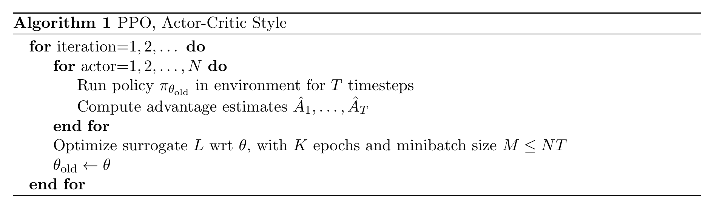

🌍From [zhihu](https://zhuanlan.zhihu.com/p/468828804) <<-->> **PPO-Penalty**
* Equation
	* $\overline{R}=\sum^{T}_{t=1}\frac{p_{\theta}(a_t|s_t)}{p_{\theta'}(a_t|s_t)} A_t(s_t,a_t)-\lambda KL[\theta,\theta']$
	* $A^{\theta}(s_t,a_t)=\sum_{t'>t}\gamma^{t'-t}r_{t'}-V_{\phi}(s_t)$
* Key Words
	* **Importance Sampling**
		$\theta' \rightarrow \theta$
		* Sample the data from $\theta'$
		* Use the data to train $\theta$ many times 
		Use KL Divergence

>1️⃣0点时：我与环境进行互动，收集了很多数据。然后利用数据更新我的策略，此时我成为1点的我。当我被更新后，理论上，1点的我再次与环境互动，收集数据，然后把我更新到2点，然后这样往复迭代。
>2️⃣但是如果我仍然想继续0点的我收集的数据来进行更新。因为这些数据是0点的我（而不是1点的我）所收集的。所以，我要对这些数据做一些重要性重采样，让这些数据看起来像是1点的我所收集的。当然这里仅仅是看起来像而已，所以我们要对这个“不像”的程度加以更新时的惩罚（KL）。
>3️⃣其中，更新的方式是：我收集到的每个数据序列，对序列中每个（s, a）的优势程度做评估，评估越好的动作，将来就又在s状态时，让a出现的概率加大。这里评估优势程度的方法，可以用数据后面的总折扣奖励来表示。另外，考虑引入基线的Tip，我们就又引入一个评价者小明，让他跟我们一起学习，他只学习每个状态的期望折扣奖励的平均期望。这样，我们评估（s, a）时，我们就可以吧小明对 s 的评估结果就是 s 状态后续能获得的折扣期望，也就是我们的基线。注意哈：优势函数中，前一半是实际数据中的折扣期望，后一半是估计的折扣期望（小明心中认为s应该得到的分数，即小明对s的期望奖励），如果你选取的动作得到的实际奖励比这个小明心中的奖励高，那小明为你打正分，认为可以提高这个动作的出现概率；如果选取的动作的实际得到的奖励比小明心中的期望还低，那小明为这个动作打负分，你应该减小这个动作的出现概率。这样，小明就成为了一个评判官。
>4️⃣当然，作为评判官，小明自身也要提高自己的知识文化水平，也要在数据中不断的学习打分技巧，这就是对 $\phi$ 的更新了。

🌍From [Lil'Log](https://lilianweng.github.io/posts/2018-04-08-policy-gradient/#dpg) <<-->> Update from TRPO <<-->> **PPO-Clip**
* Without a limitation on the distance between $\theta_{old}$ and $\theta$, to maximize $J^{TRPO}(\theta)$ would lead to instability with extremely large parameter updates and big policy ratios. PPO imposes the constraint by forcing $r(\theta)$ to stay within a small interval around $1$, precisely $[1−\epsilon,1+\epsilon]$, where $\epsilon$ is a hyper-parameter. 
	* $J^{CLIP}(\theta)=E[min(r(\theta)\hat{A}_{\theta_{old}}(s,a), clip(r(\theta), 1-\epsilon, 1+\epsilon)\hat{A}_{\theta_{old}}(s,a))]$
* When applying PPO on the network architecture with shared parameters for both policy (actor) and value (critic) functions, in addition to **the clipped reward**, the objective function is augmented with **an error term on the value estimation** and **an entropy term** to encourage sufficient exploration.
	* $J^{CLIP'}(\theta)=E[J^{CLIP}(\theta)-c_1(V_{\theta}(s)-V_{target})^2 + c_2H(s,\pi_{\theta}(.))]$

🌍From [OpenAI](https://spinningup.openai.com/en/latest/algorithms/ppo.html)
* 🌕TRPO
	* BG
		* TRPO updates policies by taking the largest step possible to improve performance, while satisfying a special constraint on how close the new and old policies are allowed to be. The constraint is expressed in terms of [KL-Divergence](https://en.wikipedia.org/wiki/Kullback%E2%80%93Leibler_divergence), a measure of (something like, but not exactly) distance between probability distributions.
		
	* Facts
		* on-policy algorithm
		* useful for environments with either discrete or continuous action spaces
		
	* Equations
		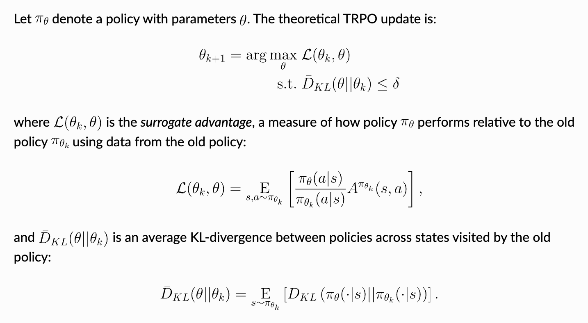
		
		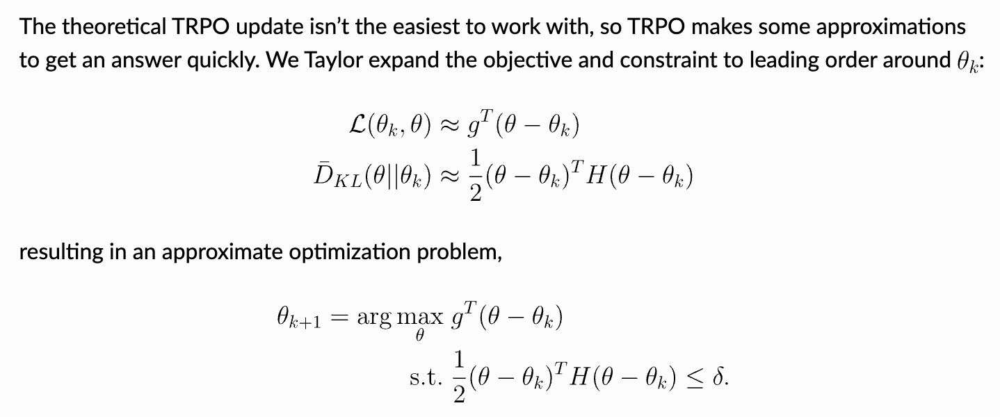
		
		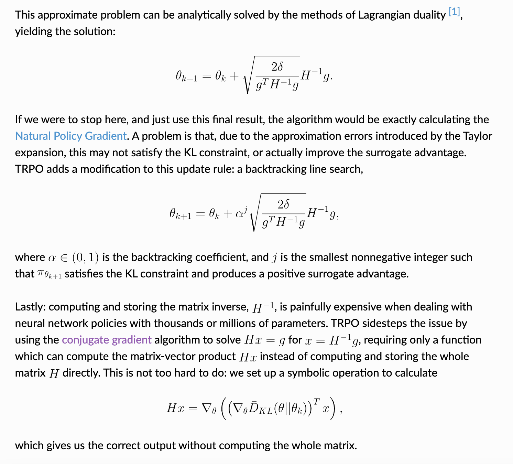
		
		* But $H^{-1}$ is the second-order derivative and its inverse, a very expensive operation.
		
	* Pseudocode
		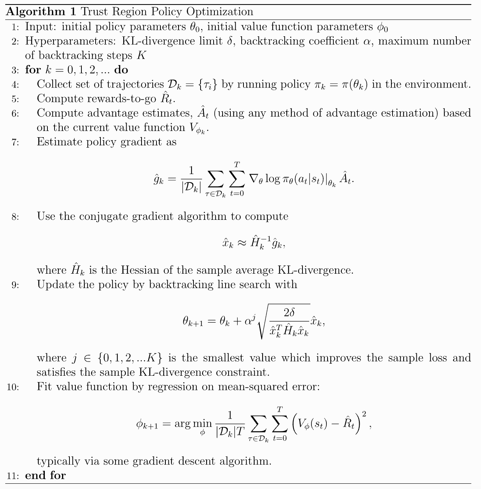
	
* 🌕PPO
	* BG
		PPO is motivated by the same question as TRPO: how can we take the biggest possible improvement step on a policy using the data we currently have, without stepping so far that we accidentally cause performance collapse? Where TRPO tries to solve this problem with a complex second-order method, PPO is a family of first-order methods that use a few other tricks to keep new policies close to old. PPO methods are significantly simpler to implement, and empirically seem to perform at least as well as TRPO.
		There are two primary variants of PPO: PPO-Penalty and PPO-Clip.
		* **PPO-Penalty** approximately solves a KL-constrained update like TRPO, but penalizes the KL-divergence in the objective function instead of making it a hard constraint, and automatically adjusts the penalty coefficient over the course of training so that it’s scaled appropriately.
		* **PPO-Clip** doesn’t have a KL-divergence term in the objective and doesn’t have a constraint at all. Instead relies on specialized clipping in the objective function to remove incentives for the new policy to get far from the old policy.
	* Facts
		- PPO is an on-policy algorithm.
		- PPO can be used for environments with either discrete or continuous action spaces.
	- Equations  - PPO-Clip
		- 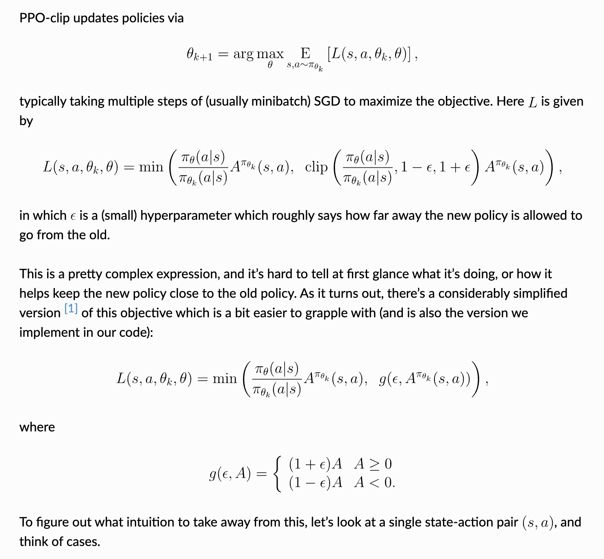
		- 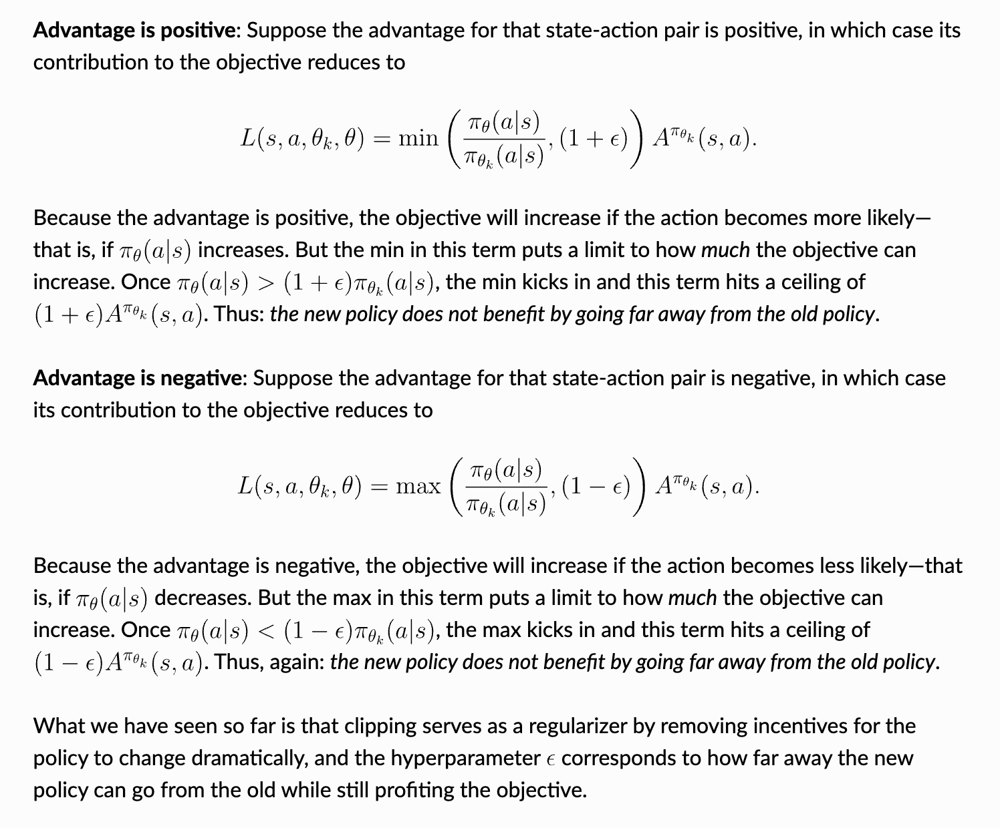
	- 🌅Pseudocode
		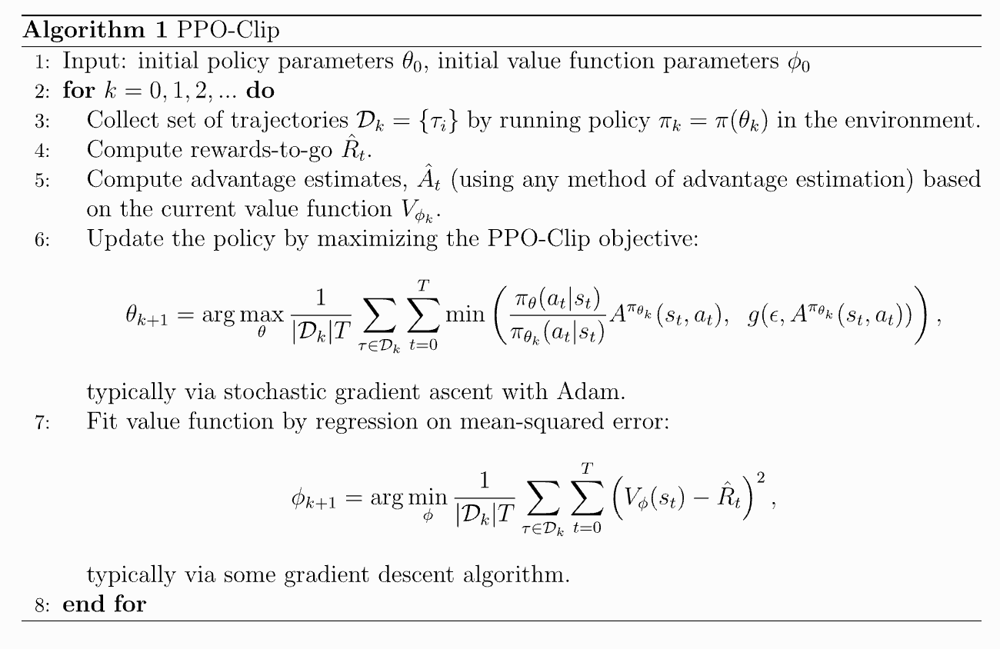

🌍 From [Jonathan Hui](https://jonathan-hui.medium.com/rl-proximal-policy-optimization-ppo-explained-77f014ec3f12)
* Motivation
	1. Q-learning (with function approximation) fails on many simple problems and is poorly understood
	2. Vanilla policy gradient methods have poor data efficiency and robustness
	3. Trust region policy optimization (TRPO) is relatively complicated, and is not compatible with architectures that include noise (such as dropout) or parameter sharing (between the policy and value function, or with auxiliary tasks).
* Abstract
	* PPO adds a soft constraint that can be optimized by a first-order optimizer. We may make some bad decisions once a while but it strikes a good balance on the speed of the optimization. 
	* Experimental results prove that this kind of balance achieves the best performance with the most simplicity.
* Method
	* PPO with KL Penalty
		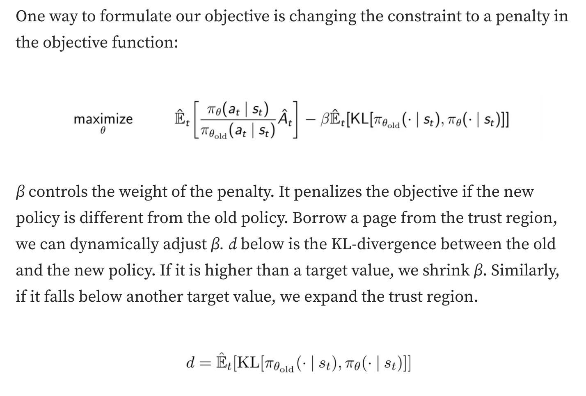
		![[PPO_kl.png" width="700">
	* PPO with Clipped Objective	
		
		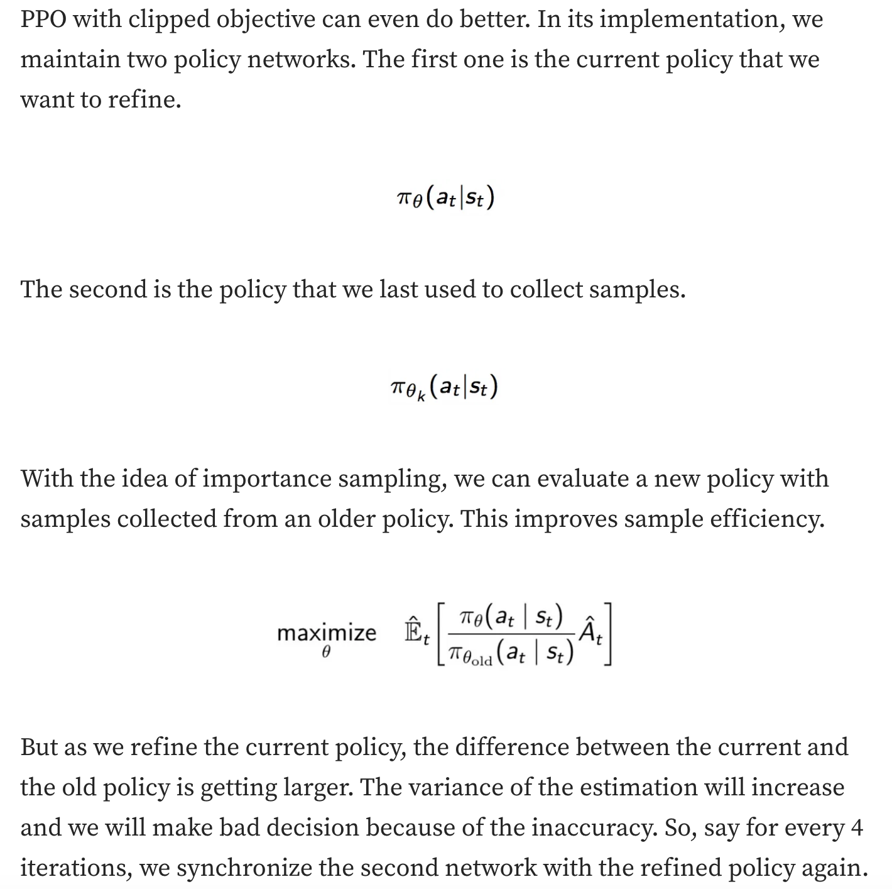
		
		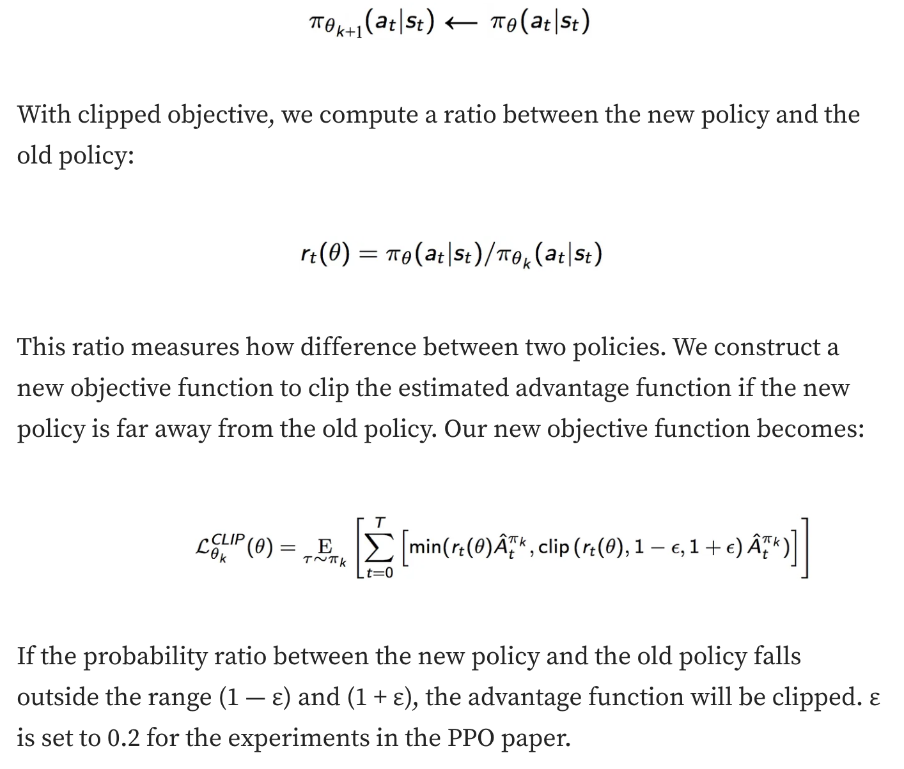
		
		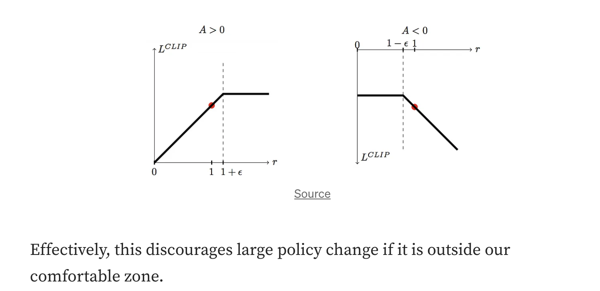
		
		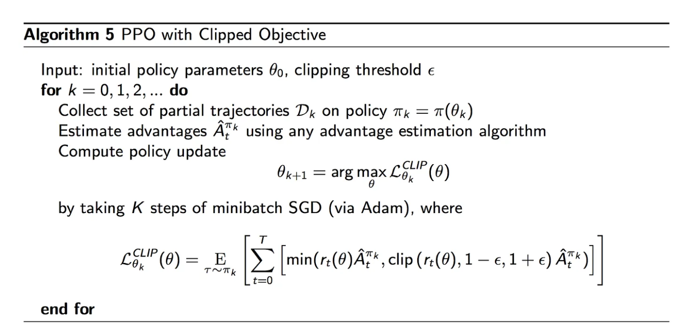

##### 9.TEMP
* Reward in this Paper: 
	$$
	R = 1 - \frac{1}{\sqrt{2}}||P_{target}-P_{agent}||_2
	$$
* To use the pre-trained representation we factorize the policy distribution, using the pre-trained encoder to translate inputs into the representation $z$:
	$$
	\pi(a|x)=\pi'(a|z)p_{\phi}(z|x)
	$$

* 🌞

🌕Distribution
在PyTorch中实现Actor-Critic模型时，选择合适的分布类型对于模型的性能至关重要，特别是当处理的是连续动作空间。根据动作空间的性质（连续或离散），常用的分布类型有：

* 🔥连续动作空间
	对于连续动作空间，通常使用以下两种分布：
	1. **正态分布（高斯分布）**：
	   - 单变量或多元正态分布（`torch.distributions.Normal` 或 `torch.distributions.MultivariateNormal`）是处理连续动作空间最常见的选择。对于每个动作维度，模型输出动作的均值和标准差（或方差），这些参数定义了动作的概率分布。
	   - 在实践中，如果动作维度相互独立，可以使用一组独立的正态分布，每个动作维度一个；如果动作维度之间存在相关性，则使用**多元正态分布**，它通过协方差矩阵捕获维度之间的相关性。
	2. **对角高斯分布**：
	   - 实际上是多元正态分布的一个特例，其中协方差矩阵是对角的。这意味着不同动作维度的概率分布被假设为**相互独立**，每个维度由单独的均值和方差参数化。这种分布常常通过自定义实现，如上文提到的`DiagGaussianDistribution`，它在底层使用`MultivariateNormal`，但限制协方差矩阵为对角线形式。
* 🔥离散动作空间
	对于离散动作空间，通常使用以下分布：
	1. **分类分布（Categorical Distribution）**：
	   - `torch.distributions.Categorical`用于模型输出为离散动作概率的情况。这适用于有限离散动作空间，模型会输出每个动作的概率，然后根据这些概率采样动作。这是实现离散动作空间策略最直接的方法。
	2. **伯努利分布（Bernoulli Distribution）**：
	   - 对于二元动作空间（即每个动作只有两种可能的结果），`torch.distributions.Bernoulli`可能是更合适的选择。它通常用于每个动作可以看作独立的是/否决策的情况。
* 🔥实现注意事项
	在实现Actor-Critic模型时，选择哪种分布类型取决于环境的动作空间类型（连续还是离散）和动作维度之间是否独立。对于连续动作空间，**正态分布**和**对角高斯分布**提供了一种有效的方式来模拟动作的不确定性和多样性。对于离散动作空间，**分类分布**提供了一种简洁的方式来表示每个动作的概率，并从中采样。
	
	在定义分布和采样动作时，重要的是要确保动作的采样过程是可微的，以便可以通过反向传播算法来优化策略网络的参数。PyTorch的分布库已经考虑到了这一点，使得在强化学习中实现Actor-Critic模型变得相对简单且高效。

🌕Entropy

在PPO（Proximal Policy Optimization）的论文中，虽然没有直接提到使用交叉熵（cross-entropy）作为损失函数的部分，但在实现PPO算法的代码中，交叉熵常被用于处理特定的优化问题，特别是与策略网络的输出相关的问题。这种看似的差异实际上源于论文描述算法的理论框架与算法在实际应用中的具体实现之间的区别。下面我们来探讨为什么会有这种差异。
* 🌛PPO论文的重点
	PPO论文主要关注的是如何有效地优化策略，以提高强化学习任务的性能。它通过引入一种新的目标函数，该函数限制了新旧策略之间的差异，从而避免了在策略更新时出现性能剧烈下降的问题。这种方法主要通过剪裁概率比率或使用KL散度来实现，而没有直接提到交叉熵。
* 🌛交叉熵在PPO实现中的作用
	1. **策略网络的输出**：在实现PPO时，策略网络通常输出动作的概率分布。为了训练这个网络使其输出与期望的动作分布尽可能接近，交叉熵是一个非常自然的选择，因为它是衡量两个概率分布差异的常用方法。
	2. **鼓励探索**：使用交叉熵作为损失的一部分可以帮助算法在探索环境时保持一定的随机性，这对于强化学习任务中的探索非常重要。
	3. **稳定性和性能**：在实际应用中，研究者发现添加交叉熵损失可以帮助提高算法的稳定性和性能。虽然这可能不是论文中原始算法描述的一部分，但在实际实现和调优过程中，根据具体任务的需要对算法进行适当的修改是很常见的。
* 🌛结论
	PPO论文中没有明确提到交叉熵，是因为论文聚焦于描述算法的核心理论和方法，而在具体实现和优化算法性能时，根据实际需要引入**交叉熵**作为损失函数的一部分**是实践中的常见做法**。这种实践反映了理论与实际应用之间的桥梁，展示了在将理论应用到实际问题中时可能需要的调整和优化。
